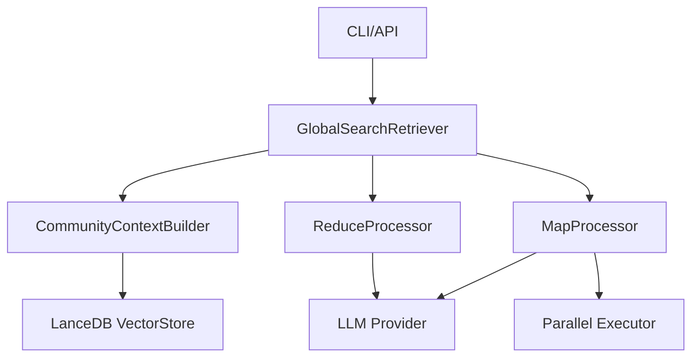

# Design Document

## Overview

GLOBAL Search機能は、MS-GraphRAGのMap-Reduceパターンを実装し、コミュニティレベルの要約情報を並列処理して包括的な回答を生成します。LlamaIndexのBaseRetrieverを継承した新しいGlobalSearchRetrieverクラスを実装し、既存のsearch_processorを置き換えます。

## Steering Document Alignment

### Technical Standards (tech.md)
- LlamaIndexフレームワークのRetrieverパターンに準拠
- MS-GraphRAG互換のMap-Reduce実装
- YAMLベースの設定管理

### Project Structure (structure.md)
- src/graphrag_anthropic_llamaindex/global_search/ - 新規モジュール
- 既存search_processor.pyは段階的に廃止

## Code Reuse Analysis

### Existing Components to Leverage
- **VectorStoreManager**: LanceDBベクターストアの管理を再利用
- **ConfigManager**: YAML設定の読み込みと管理を活用
- **LlamaIndex Core**: VectorStoreIndex, QueryBundleなど既存クラスを活用

### Integration Points
- **LanceDB Vector Store**: コミュニティサマリーインデックスとして利用
- **LLM Provider**: Anthropic/Bedrockの既存統合を使用
- **CLI Interface**: main.pyの検索コマンドを拡張

## Architecture

MS-GraphRAGのMap-Reduceパターンに基づく階層的検索アーキテクチャ。

### Modular Design Principles
- **Single File Responsibility**: Map処理、Reduce処理、コンテキスト管理を分離
- **Component Isolation**: 各処理段階を独立したクラスとして実装
- **Service Layer Separation**: 検索ロジック、LLM呼び出し、データアクセスを分離
- **Utility Modularity**: プロンプトテンプレート、トレーサビリティ管理を独立モジュール化



## Components and Interfaces

### GlobalSearchRetriever (BaseRetriever継承)
- **Purpose:** Map-Reduceベースのグローバル検索を実行
- **Interfaces:** 
  - `retrieve(query: QueryBundle) -> List[NodeWithScore]`
  - `aretrieve(query: QueryBundle) -> List[NodeWithScore]` (async)
- **Dependencies:** CommunityContextBuilder, MapProcessor, ReduceProcessor
- **Reuses:** LlamaIndex BaseRetriever基底クラス

### CommunityContextBuilder
- **Purpose:** コミュニティレポートのコンテキスト構築とバッチ分割
- **Interfaces:**
  - `build_context(query: str, min_rank: int) -> List[str]`
  - `apply_community_weights(reports: List) -> List`
- **Dependencies:** LanceDB VectorStore
- **Reuses:** 既存のvector_store_manager

### MapProcessor
- **Purpose:** 各コミュニティバッチを並列でLLM処理
- **Interfaces:**
  - `process_batch(context: str, query: str) -> MapResult`
  - `extract_key_points(response: str) -> List[KeyPoint]`
- **Dependencies:** LLM Provider, asyncio.Semaphore
- **Reuses:** 既存のLLM統合

### ReduceProcessor
- **Purpose:** Map結果を統合して最終回答を生成
- **Interfaces:**
  - `reduce(map_results: List[MapResult], query: str) -> str`
  - `format_output(result: str, format: str) -> Any`
- **Dependencies:** LLM Provider
- **Reuses:** 既存のLLM統合

### SearchModeRouter
- **Purpose:** --mode引数に基づいて適切な検索モードを実行
- **Interfaces:**
  - `route(mode: str, query: str, **kwargs) -> SearchResult`
- **Dependencies:** GlobalSearchRetriever, LocalSearcher, DriftSearcher
- **Reuses:** 既存のsearch_processor（local検索用に一時的に保持）

## Data Models

### MapResult
```python
@dataclass
class MapResult:
    batch_id: int
    key_points: List[KeyPoint]
    context_tokens: int
    processing_time: float
```

### KeyPoint
```python
@dataclass
class KeyPoint:
    description: str
    score: int  # 0-100
    report_ids: List[str]
    source_metadata: Dict[str, Any]  # document_id, chunk_id, entity_ids
```

### GlobalSearchResult
```python
@dataclass
class GlobalSearchResult:
    response: str
    response_type: str
    map_results: List[MapResult]
    traceability: TraceabilityInfo
    total_tokens: int
    processing_time: float
```

### TraceabilityInfo
```python
@dataclass
class TraceabilityInfo:
    report_ids: List[str]
    document_ids: List[str]
    chunk_ids: List[str]
    entity_ids: List[str]
```

## Error Handling

### Error Scenarios
1. **コミュニティ重み付け未設定:**
   - **Handling:** 起動時にエラーメッセージを表示して終了
   - **User Impact:** 設定ファイルの修正を促すエラーメッセージ

2. **LLM API呼び出し失敗:**
   - **Handling:** 指数バックオフでリトライ（最大3回）
   - **User Impact:** 処理中メッセージ、最終的に失敗時はエラー詳細

3. **バッチ処理の部分的失敗:**
   - **Handling:** 失敗したバッチをスキップ、成功分で続行
   - **User Impact:** 警告メッセージと部分的な結果

4. **無効な検索モード指定:**
   - **Handling:** 有効なモードリストを含むエラーメッセージ
   - **User Impact:** 使用可能なオプションの表示

## Testing Strategy

### Unit Testing
- GlobalSearchRetrieverのretrieve/aretrieveメソッド
- MapProcessorのkey point抽出ロジック
- ReduceProcessorのスコアソートと統合ロジック
- CommunityContextBuilderのバッチ分割

### Integration Testing
- LlamaIndexとの統合（BaseRetriever継承の動作確認）
- LanceDBからのコミュニティデータ取得
- 並列Map処理の同時実行制御
- 出力形式変換（markdown/json）

### End-to-End Testing
- CLIからの--mode global実行
- トレーサビリティ情報の完全性確認
- ストリーミングレスポンスの動作確認
- 階層制御（min_community_rank）の動作確認