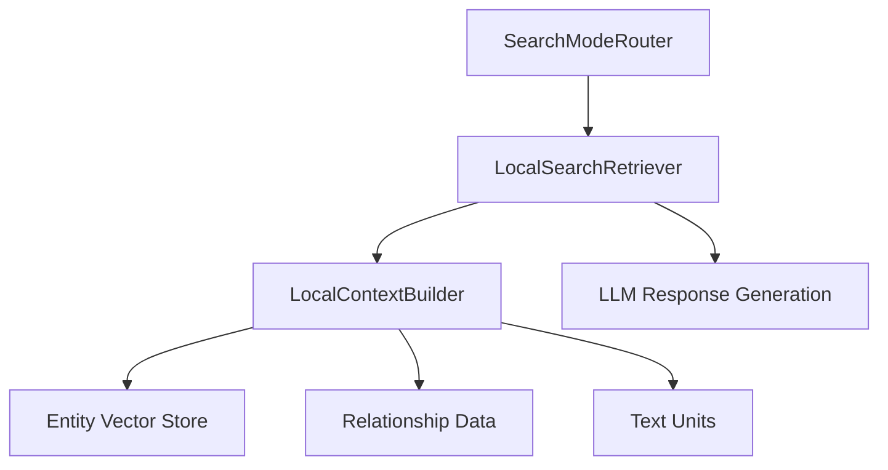

# 設計書

## 概要

ローカル検索機能は、GraphRAGシステムにおいて特定のエンティティとその関係性に焦点を当てた検索を実現します。この設計では、必要最小限の機能から始めて、段階的に拡張可能な構造を提供します。

## 実装方針

### 技術標準
- **Python 3.9+** の標準的な機能を使用
- **LlamaIndex** の既存インフラストラクチャを活用
- **型ヒント** を使用してインターフェースを明確化

### プロジェクト構造
```
src/graphrag_anthropic_llamaindex/
├── local_search/
│   ├── __init__.py
│   ├── models.py          # データモデル定義
│   ├── context_builder.py # コンテキスト構築
│   ├── retriever.py       # 検索実装
│   └── prompts.py         # プロンプトテンプレート
```

## 既存コードの再利用

### 活用するコンポーネント
- **vector_store_manager.py**: ベクトルストアの管理機能を再利用
- **llm_utils.py**: LLM関連のユーティリティを活用
- **global_search/models.py**: 基本的なデータ構造を参考に

### 統合ポイント
- **SearchModeRouter**: ルーティングシステムへの統合
- **VectorStoreIndex**: エンティティ検索用のベクトルストア
- **LlamaIndex Settings**: 既存のLLM/埋め込み設定を使用

## アーキテクチャ

### モジュール設計原則
- **単一責任**: 各ファイルは1つの明確な役割を持つ
- **疎結合**: モジュール間の依存を最小限に
- **段階的拡張**: 基本機能から始めて追加可能な構造



## コンポーネントとインターフェース

### LocalSearchRetriever
- **目的:** ローカル検索のメインエントリーポイント
- **インターフェース:**
  ```python
  def _retrieve(query_bundle: QueryBundle) -> List[NodeWithScore]
  ```
- **依存関係:** LocalContextBuilder, LLM Settings
- **再利用:** BaseRetrieverクラスを継承

### LocalContextBuilder
- **目的:** クエリに基づくコンテキスト構築
- **インターフェース:**
  ```python
  def build_context(
      query: str,
      entities: List[Entity],
      relationships: List[Relationship],
      text_units: Optional[List[TextUnit]] = None,
      max_tokens: int = 8000
  ) -> ContextResult
  ```
- **依存関係:** Entity/Relationship モデル
- **再利用:** 既存のベクトル検索機能

### EntityMapper
- **目的:** クエリからエンティティへのマッピング
- **インターフェース:**
  ```python
  def map_query_to_entities(
      query: str,
      vector_store: VectorStoreIndex,
      top_k: int = 10
  ) -> List[Entity]
  ```
- **依存関係:** VectorStoreIndex
- **再利用:** 既存のベクトル検索機能

## データモデル

### Entity
```python
@dataclass
class Entity:
    id: str
    title: str
    description: Optional[str] = None
    rank: Optional[float] = None
    text_unit_ids: List[str] = field(default_factory=list)
    attributes: Dict[str, Any] = field(default_factory=dict)
```

### Relationship
```python
@dataclass
class Relationship:
    id: str
    source: str  # Entity ID
    target: str  # Entity ID
    description: Optional[str] = None
    weight: Optional[float] = None
    attributes: Dict[str, Any] = field(default_factory=dict)
```

### TextUnit
```python
@dataclass
class TextUnit:
    id: str
    text: str
    entity_ids: List[str] = field(default_factory=list)
    relationship_ids: List[str] = field(default_factory=list)
```

### ContextResult
```python
@dataclass
class ContextResult:
    context_text: str
    entities_used: List[Entity]
    relationships_used: List[Relationship]
    text_units_used: List[TextUnit]
    total_tokens: int
```

## エラー処理

### エラーシナリオ
1. **ベクトルストア未初期化**
   - **処理:** 明確なエラーメッセージを返す
   - **ユーザーへの影響:** "Local Search not initialized" メッセージ

2. **エンティティデータ不足**
   - **処理:** 空の結果を返す
   - **ユーザーへの影響:** "No relevant entities found" メッセージ

3. **トークン制限超過**
   - **処理:** コンテキストを切り捨て
   - **ユーザーへの影響:** 部分的な結果を返す

## テスト戦略

### ユニットテスト
- データモデルの基本的な動作確認
- コンテキスト構築ロジックのテスト
- エラーケースの確認

### 統合テスト
- SearchModeRouterとの統合確認
- ベクトルストアとの連携テスト
- エンドツーエンドの検索フロー

### 手動テスト
- 実際のデータでの動作確認
- パフォーマンスの基本確認